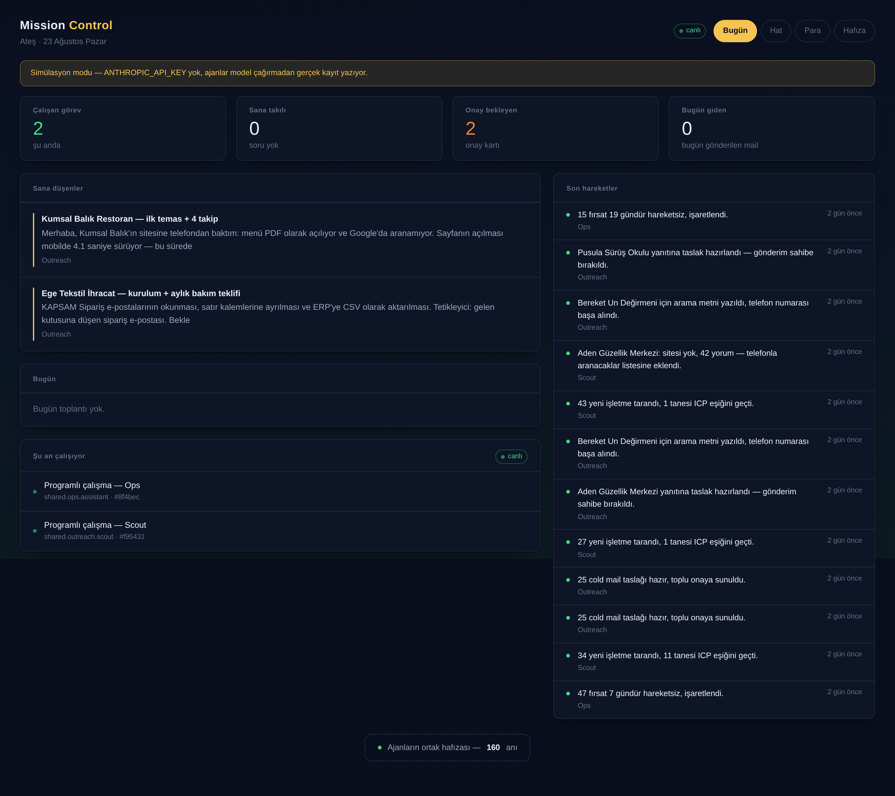
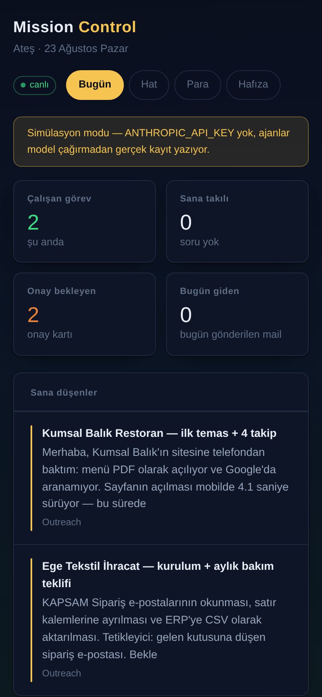
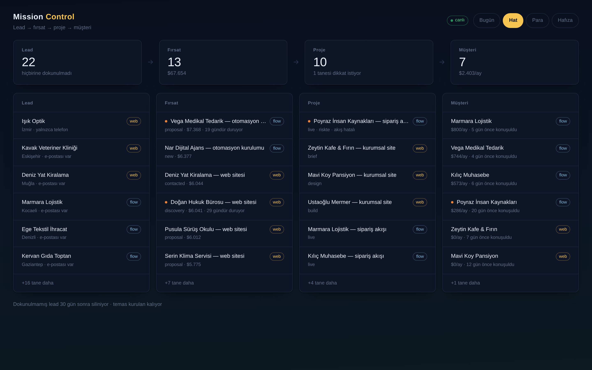
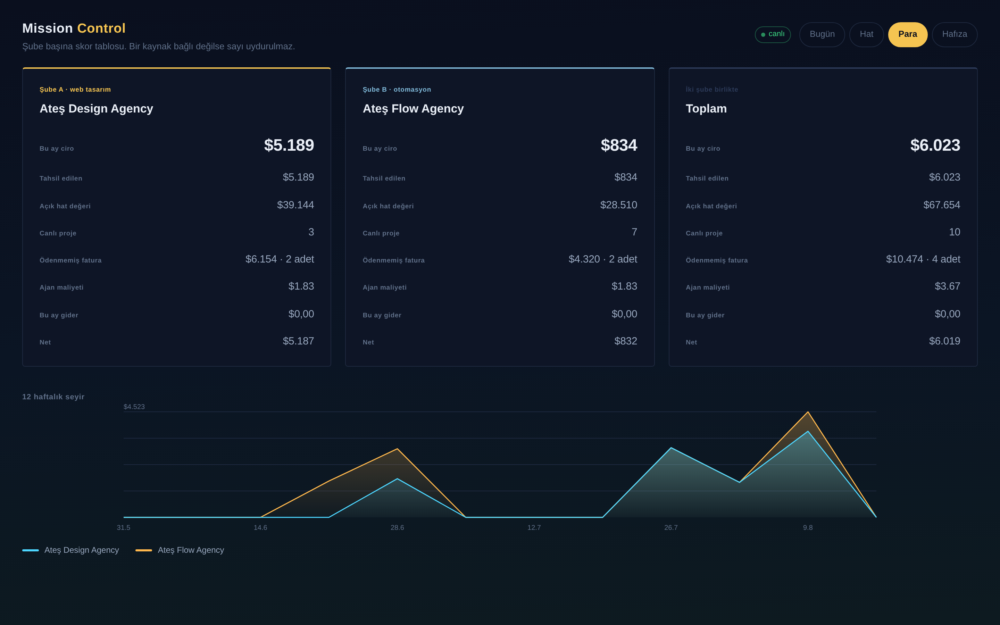
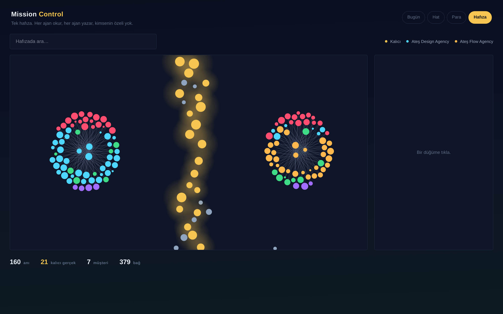
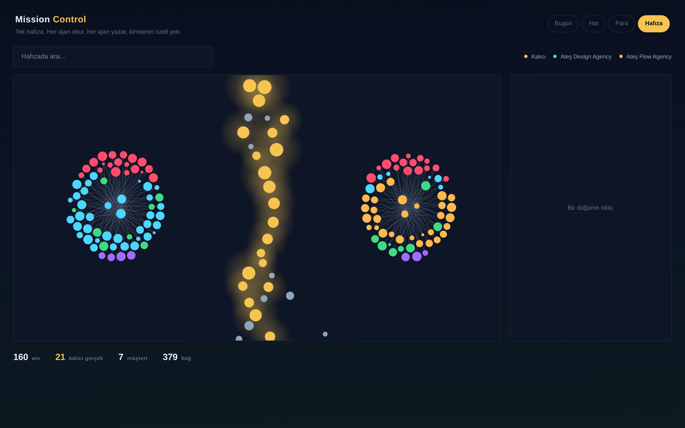

# Walkthrough

A tour of the four views — what you are looking at, what it is telling you, and
what to do with it. Screenshots are in `screenshots/`.

**One thing to know before anything else:** the panel does not command anything.
There is no button here that starts an agent, pauses one, or approves a draft.
All of that is said to the **Yönetici** on Telegram. This screen exists to answer
*ne oluyor?* at a glance — it is a mirror, and it refreshes itself when something
actually changes.

The single exception is the Brain, where you can add and delete memories. That is
editing what the agents *know*, not telling one what to do.

---

## Bugün — `/`



**The screen you open in the morning.** Ordered by claim on your attention, not
by subject.

**The gold band at the top** is the Yönetici's own framing — at most three
sentences saying which of today's numbers actually needs you, and what it would
do. The full figures are below it; its job is to choose, not to repeat. Without
`ANTHROPIC_API_KEY` the band is absent and you get the figures alone — it never
invents one to fill the space.

**The four counts.** Running tasks · questions parked on you · approvals waiting ·
mail sent today. The middle two are the ones that mean *you are the bottleneck*,
which is why they turn red and orange rather than staying grey.

**Sana düşenler** is the list that matters. Parked questions come first — a
question is holding a task still, while an approval is merely waiting to be
stamped. Each carries its short id (`#a4f2c1`), which is what you type if you
answer with `/cevap` rather than plain text.

**Bugün** is today's meetings with their Meet links, plus the day's send batch
if one is open.

**Şu an çalışıyor** is the only animated thing in the whole panel, and the dot
pulses only while a task is genuinely mid-run. Nothing else moves.

**Son hareketler** is every agent action, newest first, coloured by outcome —
green succeeded, orange blocked, red failed. This used to be its own tab; on its
own a raw log did not earn one.

At 390px the two columns become one and the counts go 2×2. Same content, no
horizontal scrolling.



---

## Hat — `/pipeline`



**Lead → fırsat → proje → müşteri**, which is the only thing the system is
actually for. Before this view those were four separate numbers on separate
screens and the line between them was nowhere.

The row of four is the shape: how many at each stage, and one line saying what
that stage is judged on — untouched leads, open pipeline value, projects needing
attention, monthly recurring revenue.

Under it, the same four stages name their rows. An orange dot means *this one
needs looking at*: a lead with no email and no phone (unreachable), a deal that
has not moved, a project at risk or a flow erroring, a client marked at-risk.
The `web` / `flow` chip says which business it belongs to.

Untouched leads are deleted after 30 days — Google's terms allow keeping place
content only temporarily. A lead you have contacted is a record of your own
business relationship and stays.

---

## Para — `/ledger`



**Per-branch P&L, plus a combined column.** Revenue, collected, open pipeline,
live projects, unpaid invoices, agent cost, expenses, and net — for Ateş Design,
for Ateş Flow, and for both together.

Money in and out is entered by hand:

```bash
npm run money -- in  --amount 4200 --branch web --client "Kumsal Balık"
npm run money -- out --amount 310  --category kira "Ofis, Ağustos"
```

There is no payment processor to read it from, by decision — cash and bank
transfer are how this business is actually paid.

**Agent cost is real, not estimated.** Every run writes its token usage and the
price of its model; the column is a sum of those rows. If a number cannot be
sourced the line says so instead of showing a zero that looks like a fact.

The 12-week chart is collections, not invoices — money that arrived.

---

## Hafıza — `/brain`



**One shared memory, and the only screen you can edit.**

Each dot is a memory. Colour is scope: gold for the web branch and for global
facts, blue for automation, grey for client context. A ring around a dot means
**kalıcı gerçek** — something you told the system directly, which no agent may
prune. Lines are links the Brain drew between related memories.

Search filters the field. Click a node to open it:



The panel shows the full text, its scopes, which agent wrote it, its confidence
and how often it has been recalled. Two things you can do here:

- **Not ekle** — write a permanent fact into the same scopes as the node you are
  looking at, so it reaches the same agents that memory does.
- **Sil** — remove a memory. Permanent facts have no delete button; they are
  yours and the panel will not offer to drop them by accident.

Scope is the isolation boundary and it is the one thing worth getting right. A
memory is either `global` **or** branch-scoped, never both — `global` reaches
everyone, and adding it alongside `branch.web` silently opens the whole thing.
From the command line:

```bash
npm run remember -- --scope branch.web "Web ICP: sitesi olmayan, en az 1 yorumu olan işletme."
npm run remember -- --list branch.web
```

`--scope` has no default on purpose.

---

## The morning brief

Every day at `brief.time` (07:30 by default, changeable by saying so on
Telegram) the brief arrives on your phone: today's meetings, active projects
with their stages and due dates, open deals with the stalled ones named, clients
who have gone quiet past the threshold, cash, and what needs you. The Yönetici
writes two or three sentences on top; every figure under them is counted.

```bash
npm run brief            # what lands on your phone
npm run brief -- --raw   # figures only, no model call
```

The evening summary follows the opposite rule: it arrives **only if something
happened** — a mail went out, an approval closed, a meeting was booked, a task
finished. On a quiet day it does not arrive at all.

---

## The day's outreach

Once a day at `outreach.batch_time` the system picks the day's leads, has the
Outreach agent write the drafts, and sends you **one** message:

```
📮 24 Ağustos — günün listesi
Plan: 7 mail (senin isteğin, normalde 10) · 5 arama

MAİL — onayını bekliyor
 1. Kumsal Balık · info@kumsalbalik.com
    "Menünüzü telefondan güncelleyebildiğiniz bir sistem…"
 …

ARAMA — sen arayacaksın, onay gerekmiyor
 A. Deniz Kuaför · 0532 xxx xx xx · 47 yorum, sitesi yok
 …
```

You answer once: `gönder` · `3 hariç` · `1,2,5` · `iptal`. Rejecting with a
reason ("fiyat yanlış") brings that business back tomorrow with a corrected
draft; rejecting without one takes it off the list for good.

You can change any day by saying so — *"bugün atma"*, *"bugün 7 tane at"*,
*"yarın sadece web"*. That is a **one-day** instruction and expires on its own;
*"günlük mail sayısını 7 yap"* is the permanent version.

---

## Watching one agent work

```bash
npm run agent:run -- shared.outreach.scout
npm run agent:run -- shared.ops.assistant --task "45 bin TL kaç dolar?"
```

Every run writes one `activity` row — what it did, why, what it cost, how long
it took, and one line of what it is genuinely unsure about. Without an API key
it runs in simulate mode: real rows, no model call, labelled as such.

```bash
npm run tick -- --plan   # what is scheduled
npm run tick             # run whatever is due right now
```
